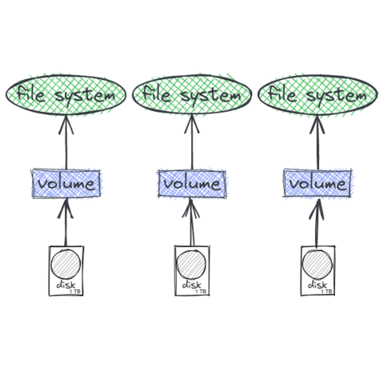
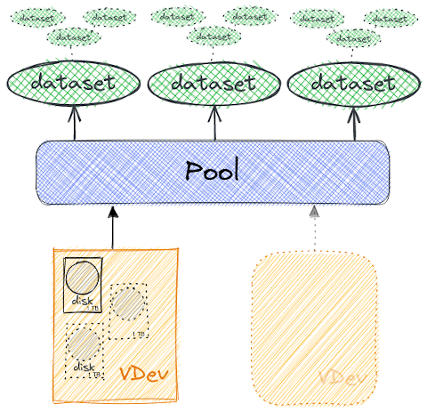
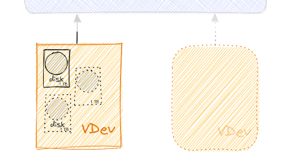
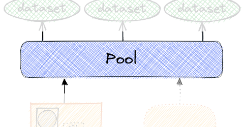
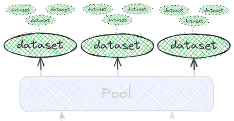
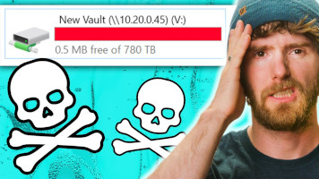

<!-- theme: uncover -->

# Découvrez ZFS

Un stockage fiable, puissant et accessible

                        

---

# Qui suis-je 🗣️

🐔 🚑️ **soigneur de pool ZFS** @ OVHcloud (2020)

* 👪 père de famille
* 🛠️ construction et usage des outils
* 🐍 communauté francophone Python ([AFPy](http://afpy.org/))

---

# Stockage fichier 📁

* **processus de sauvegarde**
* **système virtualisés** (_Images de machine virtuelle_)
* **base de données** (_besoin spécifiques_)
* **traitement de données** (_cache, tampon, etc…_)

---

## ZFS ❓

- _Zettabyte File System_

---

## ZFS ❓

- _Zettabyte File System_ …ou pas

> I picked ZFS for the simplest of reasons: it sounds cool

_[Jeff Bonwick](https://archive.wikiwix.com/cache/index2.php?url=https%253A%252F%252Fblogs.oracle.com%252Fbonwick%252Fen_US%252Fentry%252Fyou_say_zeta_i_say)_

---

**🗺️ Le plan**

- 🕰 Historique
- 💡 Principaux concepts ZFS
- 🛠️ Usages et choix chez OVH
- 💩 Faites gaffe quand même… 😱

---

**🕰 Historique**

- **2001**: 🍼 **Naissance** chez [Sun Microsystems](https://en.wikipedia.org/wiki/Sun_Microsystems)
- **2005**: Le **code source** de ZFS est **publié**
- **2008**: ZFS est publié dans **FreeBSD 7.0**
- **2010**: 💰 Rachat **Oracle**
- **2010**: [Illumos](https://illumos.org/)/ [OpenSolaris](https://en.wikipedia.org/wiki/OpenSolaris)
- **2013**: Naissance **OpenZFS**
- **2020**: 🌋 [ZFS 2.0](https://github.com/openzfs/zfs/releases/tag/zfs-2.0.0) Fusion du code **FreeBSD/Linux**

---

# Principaux concepts ZFS 💡

---

**Gestionnaire de volume & système de fichiers**
💾     📀

            

---

* `VDEV == Virtual DEVice`
* miroir (+2 disques)
* [RAID-Z](https://en.wikipedia.org/wiki/ZFS#RAID_(%22RAID-Z%22)) (1 à 3)
    * Blocs de taille variable
    * Parité distribuée (~[RAID5](https://en.wikipedia.org/wiki/Standard_RAID_levels#RAID_5))
* Log / Cache / _spare_

---

* Constitué de `VDEV`
* Peut s'agrandir / réduire (_sous conditions_)
* Maintenance préventive
    - reconstruction, _scrub_, **data et metadata**
* Contient des _datasets_

---

* **Type:** _file-system_, _snapshot_, _clone_, _volume_
* **Héritage:** Gigogne / arborescent
* **Propriétés:** réservation, quota, compress°, dedup°, accès autorisé (ACLs), personalisée, etc.

---

**⚡ Cache**

* [_Adaptative Replacement Cache_](https://pthree.org/2012/12/07/zfs-administration-part-iv-the-adjustable-replacement-cache/)
* MFU  & MRU (Most Frequently/Recently Used)
    - L1 (Level 1) -> RAM
    - L2 -> disque
* ZIL (ZFS Intent Log) -> disque
    - ⚠️ persistance & redondance
    - ➡️ [PM Gandi](#27)

---

**🎆 Copy-On-Write**

* _«efface plus tard, ne modifie jamais»_ 🗑️ ⌛
* ✅ Modèle transactionnel toujours cohérent
    * pas de [`fsck`](https://en.wikipedia.org/wiki/Fsck), jamais (_[write hole](https://en.wikipedia.org/w/index.php?title=RAID_5_write_hole&redirect=no)_)
* 📸 Instantané (Snapshot)
* 🔁 Send / receive
    - 🚀 plus rapide que [`rsync`](https://en.wikipedia.org/wiki/Rsync)
* ⚠️ Gestion de l'espace et taux de remplissage

---

**🤓 Administration simple**

* Interventions à chaud / en ligne
    * manipulation de disque
    * reconstruction et _scrub_ (*donnée et metadonnée*)
* 2 commandes: [`zpool`](https://man.freebsd.org/cgi/man.cgi?query=zpool) / [`zfs`](https://man.freebsd.org/cgi/man.cgi?query=zfs)
* Délégation de droit: `zfs allow <user> <perm> <dataset>`

---

# Chez OVHcloud ❓

---

  

- _Baremetal_
- _Digital core_ (Databases)
- et _Storage_

---

_Baremetal_

* mirroirs d'image
    - netboot
    - d'installation
        * Debian
        * 180T / HDD 6TB / RAID-Z
        * 1 scrub mensuel (24h)

---

_Digital Core Databases_

* sauvegardes MySQL & Postgres
    - ZFS sur l'infra replica ~300T
    - atout: snapshoting et _send/receive_

---

**Storage** (_produits_)

|Product                |PB used    |VDev type  |
|:----------------------|:---------:|:----------|
|[Datastore PCC][1]     | 42        | mirror    |
|[Backup storage][2]    | 24        | RAID-Z    |
|[Web][3] & [Mail][4]   | 21        | mirror    |
|[NASHA][5]             | 8         | mirror    |
|Internal               | 0,5       | mirror    |
| _Backup_              | 128       | RAID-Z    |

[1]: https://www.ovhcloud.com/fr/enterprise/products/hosted-private-cloud/
[2]: https://www.ovhcloud.com/fr/bare-metal/backup-storage/
[3]: https://www.ovhcloud.com/fr/web-hosting/
[4]: https://www.ovhcloud.com/fr/emails/
[5]: https://www.ovhcloud.com/fr/storage-solutions/nas-ha/

---

**Storage** (gestion)

* ~128 VM
* Outil de sauvegarde distant ([BorgBackup](https://www.borgbackup.org/))
    - petit volume / (3 sites distants)
* DB de monitoring ([Zabbix](https://www.zabbix.com/))
    -  compression / mirroir / baremetal

---

**Storage** (incidents)

* Ça nous arrive aussi… 😱
* Mais en proportion minime
* **2022:** _2 corruptions clients_
    - ➡️ restaurations de sauvegardes
    - ℹ️ défaillance disques en simultané

---

# 🧙‍♂️ Le secret ?️

* 👪 Une équipe qui assure
* 🛠️ De bons outils…

---

`zfswatchd`

👼 👩‍🔧 👩‍🚒 🤖

* 🕰 2016, développé en interne
* démon multi-OS (python)
    * indépendant et autonome
* Déclenche et monitore la gestion des disques
* 👂 [SMART](https://www.smartmontools.org/), ZFS, OS
* 🗣️ Datacentre, opérations, OS

---

`zfswatchd`

| Disk intervention     | Quantity  |
|-----------------------|:----------|
| average monthly       |81         |
| average weekly        |22         |
| Total (since 2016)    |15038      |
| monthly scrub         |7423       |

---

# 💩 Faites gaffe quand même… 😱

---

[Gandi - Postmortem: 2020 September 30 storage incident](https://news.gandi.net/en/2020/10/postmortem-september-30-storage-incident/)

➡️  Erreur humaine: HDD -> ZIL (SSD)

---

**LTT - Our data is GONE... Again**

➡️ Erreurs humaines: manque de soins

---

# 🤝 Merci !

- [_Matt Ahrens_](https://openzfs.org/wiki/User:Mahrens) & _George Wilson_ pour: [OpenZFS Basics at SCALE16x](https://www.youtube.com/watch?v=MsY-BafQgj4) (March 2018)
- Ubuntu — [An overview of ZFS concepts](https://manpages.ubuntu.com/manpages/lateiist/en/man8/zfsconcepts.8.html)
- FreeBSD Handbook — [The Z File System (ZFS)](https://docs.freebsd.org/en/books/handbook/zfs/)
- [Things Nobody Told You About ZFS](http://nex7.blogspot.com/2013/03/readme1st.html)
- `PU.Baremetal` (_Louis_,…), `PU.Digital Core DB` ([_Julien_](https://julien.riou.xyz/)), `PU.Webhosting` (_Maxime_, …)
- **PU.storage team** ❤️

---

# ⁉️ Questions , remarques, …

_Sources_ : **`github.com/fzindovh/talk-zfs`**
