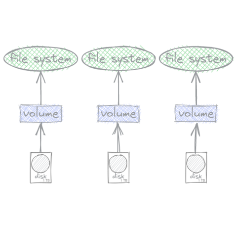

<!-- theme: uncover -->

# Discover ZFS

A reliable, powerful and accessible storage

                        

---

# Who am I 🗣️

🐔 **ZFS pool lifeguard** @ OVHcloud (2020)

* 👪 father
* 🛠️ build and use tools
* 🐍 Python Francophone community ([AFPy](http://afpy.org/))

---

# 📁 file storage

* **backup process**
* **virtualised system** (_Virtual machine images_)
* **database** (_specific requirements_)
* **data processing** (_cache, buffer, etc…_)

---

## ZFS ❓

* _Zettabyte File System_

---

## ZFS ❓

- _Zettabyte File System_…or not

> I picked ZFS for the simplest of reasons: it sounds cool

_[Jeff Bonwick](https://archive.wikiwix.com/cache/index2.php?url=https%253A%252F%252Fblogs.oracle.com%252Fbonwick%252Fen_US%252Fentry%252Fyou_say_zeta_i_say)_

---

**🗺️ Plan**

- 🕰 History
- 💡 ZFS concepts
- 🛠️ Uses and choices at OVH
- 💩 Beware anyway… 😱

---

**🕰 History**

- **2001**: 🍼 **Birth** at [Sun Microsystems](https://en.wikipedia.org/wiki/Sun_Microsystems)
- **2005**: ZFS **source code** is **published**
- **2008**: ZFS is published in **FreeBSD 7.0**
- **2010**: 💰 Sun buyout by **Oracle**
- **2010**: [Illumos](https://illumos.org/)/ [OpenSolaris](https://en.wikipedia.org/wiki/OpenSolaris)
- **2013**: 🍼 Birth **OpenZFS**
- **2020**: 🌋 [ZFS 2.0](https://github.com/openzfs/zfs/releases/tag/zfs-2.0.0) Code Merge **FreeBSD/Linux**

---

#  ZFS key concepts💡

---

**Volume Manager & File System**

---

**Volume Manager & File System**

---

* `VDEV == Virtual DEVice`
* mirror (+2 disks)
* [RAID-Z](https://en.wikipedia.org/wiki/ZFS#RAID_(%22RAID-Z%22)) (1-3)
    * Variable block size
    * Distributed parity (~[RAID5](https://en.wikipedia.org/wiki/Standard_RAID_levels#RAID_5))
* Log / Cache / spare

---

* Consisting of `VDEV`
* Can expand / collapse (_under conditions_)
* Preventive maintenance
    - reconstruction, scrub, **data and metadata**
* Contains datasets

---

* **Type:** file-system, snapshot, clone, volume
* **Legacy:** nested / arborescent
* **Properties:** reservation, quota, compress°, dedup°, authorised access (ACLs), personalised, etc.

---

**⚡ Cache**

* [_Adaptative Replacement Cache_](https://pthree.org/2012/12/07/zfs-administration-part-iv-the-adjustable-replacement-cache/)
* MFU  & MRU (Most Frequently/Recently Used)
    - L1 (Level 1) -> RAM
    - L2 -> 📀
* ZIL (ZFS Intent Log) -> 📀
    - ⚠️ persistence & redundancy
    - ➡️ [PM Gandi](#28)

---

**🎆 Copy-On-Write**

* _“delete later, never modify”_ 🗑️ ⌛
* ✅ consistently transactional model
    * no [`fsck`](https://en.wikipedia.org/wiki/Fsck), never ([write hole](https://en.wikipedia.org/w/index.php?title=RAID_5_write_hole&redirect=no))
* 📸 Snapshot
* 🔁 Send / receive
    - 🚀 faster than [`rsync`](https://en.wikipedia.org/wiki/Rsync)
* ⚠️ Space management and usage

---

**🤓 Easy administration**

* Hot/online operations
    * disk manipulation
    * resilvering and scrub (*data and metadata*)
* 2 commands: [`zpool`](https://man.freebsd.org/cgi/man.cgi?query=zpool) / [`zfs`](https://man.freebsd.org/cgi/man.cgi?query=zfs)
* Delegation rights: `zfs allow <user> <perm> <dataset>`

---

# At OVHcloud❓

---

  

- _Baremetal_
- _Digital core_ (Databases)
- and _Storage_

---

_Baremetal_

* image mirrors
    - netboot
    - installation
        * Debian
        * 180T / HDD 6TB / RAID-Z
        * 1 monthly scrub (24h)

---

_Digital Core Databases_

* MySQL & Postgres backups
    - ZFS on the ~300T replica infrastructure
    - asset: snapshoting and send/receive

---

**Storage** (_products_)

|Product                |PB used    |VDev type  |
|:----------------------|:---------:|:----------|
|[Datastore PCC][1]     | 42        | mirror    |
|[Backup storage][2]    | 24        | RAID-Z    |
|[Web][3] & [Mail][4]   | 21        | mirror    |
|[NASHA][5]             | 8         | mirror    |
|Internal               | 0,5       | mirror    |
| _Backup_              | 128       | RAID-Z    |

[1]: https://www.ovhcloud.com/fr/enterprise/products/hosted-private-cloud/
[2]: https://www.ovhcloud.com/fr/bare-metal/backup-storage/
[3]: https://www.ovhcloud.com/fr/web-hosting/
[4]: https://www.ovhcloud.com/fr/emails/
[5]: https://www.ovhcloud.com/fr/storage-solutions/nas-ha/

---

**Storage** (management)

* ~128 VM
* Remote backup tool ([BorgBackup](https://www.borgbackup.org/))
    - small volume / (3 remote sites)
* Monitoring DB ([Zabbix](https://www.zabbix.com/))
    - compression / mirroring / bare metal

---

**Storage** (incidents)

* It also happens to us… 😱
* But in small proportion
* **2022:** _2 customer corruptions_
    - ➡️ backup restoration
    - ℹ️ simultaneous disk failure

---

# 🧙 Secret?️

* 👪 a team that rocks
* 🛠️ good tools…

---

`zfswatchd`

👼 👩‍🔧 👩‍🚒 🤖

* 🕰 2016, in-house developed
* multi-OS daemon (python)
    * independent and autonomous
* Triggers and monitors disk management
* 👂 [SMART](https://www.smartmontools.org/), ZFS, OS
* 🗣️ Datacentre, operations, OS

---

`zfswatchd`

| Disk intervention     | Quantity  |
|-----------------------|:----------|
| average monthly       |81         |
| average weekly        |22         |
| Total (since 2016)    |15038      |
| monthly scrub         |7423       |

---

# 💩 Be careful… 😱

---

[Gandi - Postmortem: 2020 September 30 storage incident](https://news.gandi.net/en/2020/10/postmortem-september-30-storage-incident/)

➡️ human error: HDD -> ZIL (SSD)

---

**LTT - Our data is GONE… Again**

➡️ Errors: lack of care

---

# 🤝 Thank you!

- [_Matt Ahrens_](https://openzfs.org/wiki/User:Mahrens) & _George Wilson_ for: [OpenZFS Basics at SCALE16x](https://www.youtube.com/watch?v=MsY-BafQgj4) (March 2018)
- Ubuntu — [An overview of ZFS concepts](https://manpages.ubuntu.com/manpages/lateiist/en/man8/zfsconcepts.8.html)
- FreeBSD Handbook — [The Z File System (ZFS)](https://docs.freebsd.org/en/books/handbook/zfs/)
- [Things Nobody Told You About ZFS](http://nex7.blogspot.com/2013/03/readme1st.html)
- `PU.Baremetal` (_Louis_,…), `PU.Digital Core DB` ([_Julien_](https://julien.riou.xyz/)), `PU.Webhosting` (_Maxime_, …)
- **PU.storage team** ❤️

---

# ⁉️ Questions, remarks…

_Sources_ : **`github.com/fzindovh/talk-zfs`**
