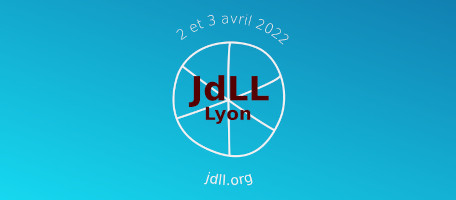
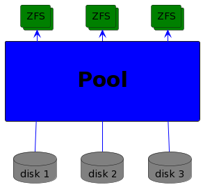
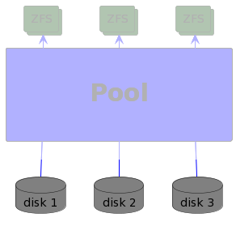
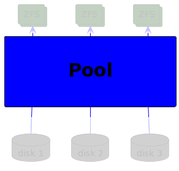
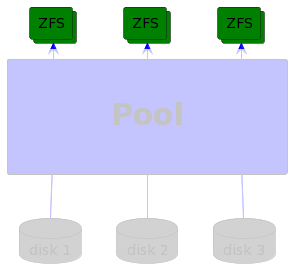

<!-- theme: uncover -->

# Histoires d'un sysadmin perfectionniste sous pression

_2 avril 2022 - Frédéric Zind - JDLL (Lyon)_

---

## Découvrez openZFS : un stockage fiable, puissant et accessible.

---

# 👨 Qui suis-je ?

* 🔧 2000: technicien en mécanique
* 🐍 2018: apprenti charmeur de serpent
* 🧰 2019: dev django
* 🚑️ 2020: Soigneur de _pool_ ZFS (sys admin)

---

# 🔍 C'est quoi ZFS

* Gestionnaire de volume ET système de fichiers
* Stockage en _pool_
* _Copy-On-Write_
* Usage agressif de _cache_ (la RAM)
* Administration simple

---

# 💾 Gestion traditionnelle

---

# 📀 Gestion par pool

---

### 📝 Historique

- 2001 : Naissance chez Sun
- 2005 : Le code source de ZFS est publié
- 2008 : ZFS est publié dans FreeBSD 7.0
- 2010 : Rachat Oracle arrêt contributions ZFS
- 2010 : Illumos successeur d'OpenSolaris
- 2013 : Naissance OpenZFS
- 2020 : ZFSv2 Fusion du code FreeBSD/Linux

---

# 💡 Quelques concepts

---

# 💾 vdev

---

## 💾 vdev

* Miroir
* _RAID-Z_
* _spare_ (chaud ou froid)
* Log (ZIL)
* Cache (L2ARC)

---

# 🐔 Pool

---

## 🐔 Pool

* Gère les disques
* Peut s'agrandir +++
* Maintenance préventive
* Contient des _datasets_

---

# 🗄️ Dataset

---

## 🗄️ Dataset

* File system, snapshot, clone, …
* < 2^48 datasets / pool
* Gigogne/arborescent avec héritage
* Propriétés
    - Reservation / Quota (dataset/reference)
    - Compression, deduplication
    - ACLs, Prop. personalisée avec `:`, etc.

---

# ⚡ Cache

- ARC
- L2ARC

---

# 🎆 Modèle transactionnel

* _Copy-On-Write_
    * Toujours cohérent: pas de FSCK, jamais
* Snapshots
* Send / receive
    - Expédition de snapshots
    - Unidirectionnel
    - Re-démarrable

---

# 🤓 Administration simple

* Administration a chaud/online
* 2 commandes:
    - `zpool`: _pool_
    - `zfs`: _dataset_
* Délégation

---

# 🤝 Communauté

- code base unique: FreeBSD / Linux
* macOS©®
* Windows©®

---

# ⚠️ Nota bene

* ZFS 💚 RAM
* Choix des vdevs: IOPS **ou** stockage
* snapshots != sauvegardes
* La compression coute moins cher que la déduplication
* Ce n'est pas parce que c'est possible qu'il faut le faire
* Pas de magie !

---

# 💩 Faites gaffe quand même…

---

[Gandi - Postmortem: September 30 storage incident](https://news.gandi.net/en/2020/10/postmortem-september-30-storage-incident/)

> 30/09/2020 @ 05:38 UTC, one of our storage units went down.
>
> 30/09/2020 @ 11:52 UTC we managed to bring the storage unit back online.

➡️ Erreur humaine: HDD -> ZIL (SSD)

---

**LTT - Our data is GONE... Again**

➡️ Erreurs humaines

---

# 🤝 Références & merci

- [Matt Ahrens](https://openzfs.org/wiki/User:Mahrens) & [George Wilson]() pour: [OpenZFS Basics at SCALE16x, March 2018](https://www.youtube.com/watch?v=MsY-BafQgj4)
- [Ubuntu — An overview of ZFS concepts](https://manpages.ubuntu.com/manpages/lateiist/en/man8/zfsconcepts.8.html)
- [FreeBSD Handbook — The Z File System (ZFS)](https://docs.freebsd.org/en/books/handbook/zfs/)
- [Things Nobody Told You About ZFS](http://nex7.blogspot.com/2013/03/readme1st.html)
- _PU.storage team_

---

# Merci !

---

# ⁉️ Questions , remarques, réclamations, etc.

http://pro.zind.fr
