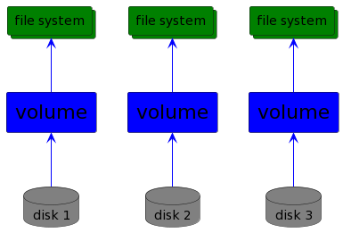
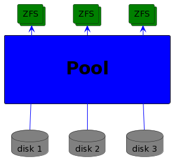
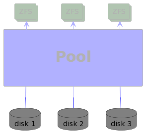
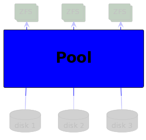
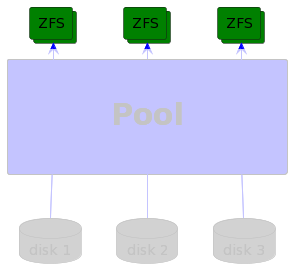
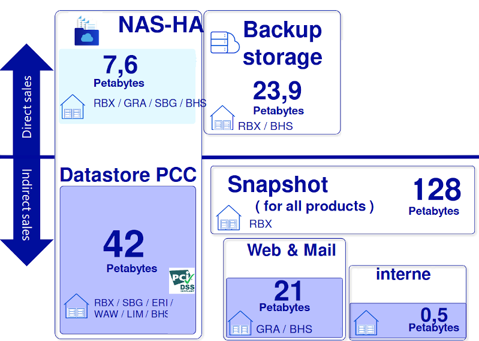
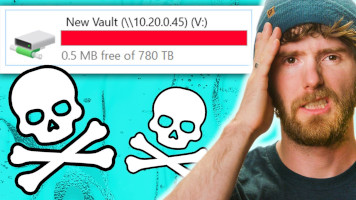

<!-- theme: uncover -->

# openZFS / VTT 2023

                        

---

# 📁 Stockage fichier

* système virtualisés: _pour des images de VM_
* traitement de données*: _collecte avant traitement_
* base de donnée*: _administrations, architecture, …_
* processus de sauvegarde*: _Équipe archivage_

---

# 🗣️ Qui suis-je ?

---

**🗣️ Qui suis-je ?**

🐔 🚑️ soigneur de pool ZFS chez OVHcloud depuis 2020 `VU.ops`/`PU.storage`

* 👪 père de famille
* 🛠️ construction et usage des outils
* 🐍 communauté francophone Python ([AFPy](http://afpy.org/))

---

**🔊 De quoi va-t on parler 🔊**

* 🔍 C'est quoi ZFS?
* 💡 Principaux concepts ZFS
* 🛠️ Usages et choix chez OVH
* 💩 Faites gaffe quand même…

---

# 🔍 C'est quoi ZFS

* Gestionnaire de volume **ET** système de fichiers
* Stockage en _pool_
* _Copy-On-Write_
* Administration simple
* Usage agressif de _cache_

---

**📝 Historique**

- **2001**: **Naissance** chez Sun
- **2005**: Le **code source** de ZFS est **publié**
- **2008**: ZFS est publié dans **FreeBSD 7.0**
- **2010**: Rachat **Oracle** arrêt contributions ZFS
- **2010**: **Illumos** successeur d'OpenSolaris
- **2013**: Naissance **OpenZFS**
- **2020**: ZFS 2.0 Fusion du code **FreeBSD/Linux**

---

**💾 Gestion disques**

_volume_              vs.            _pool_

            

---

# 💡 Principaux concepts ZFS

---

**💾 `VDEV`**

  

-> Virtual DEVice
* _mirror_
* _RAID-Z_
* _spare_
* Log / Cache

---

**🐔 Pool**

* Contient les `VDEVs`
* Peut s'agrandir +++
* Maintenance préventive
* Contient des _datasets_

---

**🗄️ Dataset**

* File system, snapshot, clone, …
* Gigogne/arborescent avec héritage
* Propriétés: Reservation, Quota, Compression, dedup°, ACLs, perso, etc.

---

**⚡ Cache**

* L1ARC -> RAM
    * _Adaptative R Cache_
* L2ARC -> disque
* ZIL -> disque
    * ZFS Intent Log

---

**🎆 Copy-On-Write**

* ✅ Modèle transactionnel toujours cohérent (pas de FSCK, jamais)
* 📸 Snapshoting
* 🔁 Send / receive

---

**🤓 Administration simple**

* Actions à chaud/online
* 2 commandes `zpool` / `zfs`
* Délégation de droit: `zfs allow <user> <perm> <dataset>`

---

  

#❓ 🤔

---

  

* _Baremetal_
* _Digital core_ (Databases)
* _Storage_

---

_Baremetal_

* mirroirs d'image netboot (legacy)
* mirroirs d'image d'installation
    * Debian
    * 180T / 6TB 7200RPM SAS
    * 1 scrub mensuel (1 jour)

---

_Storage_: produits

---

_Storage_: backend

* DB zabbix / compression / mirroir / baremetal 2-3T
* serveur borg -> snap locaux  / petit volume / (RBX/BHS/SBG)
* ~128 VM
* rotation `zfs-autosnapshot`

---

`zfswatchd`

* 26/6/2016
* demon multi OS en python
* plusieurs vecteurs SMART, ZFS, OS spécifique
* pro-actif
* monitoring d'événement

---

# 💩 Faites gaffe quand même…

---

[Gandi - Postmortem: September 30 storage incident](https://news.gandi.net/en/2020/10/postmortem-september-30-storage-incident/)

> 30/09/2020 @ 05:38 UTC, one of our storage units went down.
>
> 30/09/2020 @ 11:52 UTC we managed to bring the storage unit back online.

➡️  Erreur humaine: HDD -> ZIL (SSD)

---

**LTT - Our data is GONE... Again**

➡️ Erreurs humaines

---

**Et enfin…**

# 🧑

> J’ai encore beaucoup de choses à apprendre, mais j’ai vu une présentation qui m’a expliqué les bases de ZFS. L'outil n'est pas magique, mais permet d'adresser plein de problématiques de stockage: **j'ai envie d'essayer 🛠️ 🚀**

_- Vous !_

---

# 🤝 Merci !

Références

- [Matt Ahrens](https://openzfs.org/wiki/User:Mahrens) & [George Wilson]() pour: [OpenZFS Basics at SCALE16x, March 2018](https://www.youtube.com/watch?v=MsY-BafQgj4)
- [Ubuntu — An overview of ZFS concepts](https://manpages.ubuntu.com/manpages/lateiist/en/man8/zfsconcepts.8.html)
- [FreeBSD Handbook — The Z File System (ZFS)](https://docs.freebsd.org/en/books/handbook/zfs/)
- [Things Nobody Told You About ZFS](http://nex7.blogspot.com/2013/03/readme1st.html)
- _PU.storage team_

---

# ⁉️ Questions , remarques, réclamations, etc.
