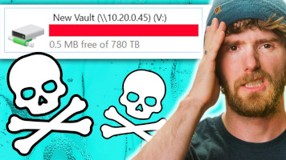

<!-- theme: uncover -->

# Histoires d'un sysadmin perfectionniste sous pression

_2 avril 2022 - Frédéric Zind - JDLL (Lyon)_

---

## Découvrez openZFS : un stockage fiable, puissant et accessible.

---

# 👨 Qui suis-je ?

* 🔧 2000: technicien en mécanique
* 🐍 2018: apprenti charmeur de serpent
* 🧰 2019: dev django
* 🚑️ 2020: Soigneur de _pool_ ZFS (sys admin)

---

# 🔍 C'est quoi ZFS

- Gestionnaire de volume ET système de fichiers
- Stockage en _pool_
- _Copy-On-Write_
- Usage agressif de _cache_ (la RAM)
- Administration simple

---

# 💾 Gestion traditionnelle

---

# 📀 Gestion par pool

---

# 📝 Histoire

- 2001 : le développement commence avec 2 ingénieurs
- 2005 : Le code source de ZFS est publié.
- 2008 : ZFS est publié dans FreeBSD 7.0.
- 2010 : Oracle cesse de contribuer au code source de ZFS.
- 2010 : illumos successeur d'OpenSolaris
- 2013 : ZFS open-source se regroupe pour former OpenZFS.
- 2014 : OpenZFS pour Mac OS X
- 2020 : OpenZFSv2 FreeBSD + Linux

---

# 💡Quelques concepts

---

# 💾 vdev

---

# 💾 vdev

- miroir
- _RAID-Z_
- _spare_ (chaud ou froid)
- Log (ZIL)
- Cache (L2ARC)

---

# 🐔 Pool

---

# 🐔 Pool

- Gere les disques
- Peut s'agrandir +++
- Maintenance préventive
- Contient des _datasets_

---

# 🗄️ Dataset

---

# 🗄️ Dataset

- File system, volume, snapshot, clone, …
- < 2^48 datasets / pool
- Possède des propriétés
- Gigogne/arborescent avec héritage
- Propriétés
    * Reservation / Quota (dataset/reference)
    * Compression
    * Deduplication
    * ACLs
    * montage local
    * …

---

# ⚡ Cache

- ARC
- L2ARC

---

# 🎆 Modèle d'objet transactionnel

- Copy-On-Write
    * Toujours cohérent sur le disque (pas de FSCK, jamais)
- Snapshoting
- Send/receive
    * expedition de snapshots
    * Unidirectionnel
    * Redémarable

---

# 🤓 Administration simple

* Administration a chaud/online
* 2 commandes:
    - `zpool`: pool
    - `zfs`: filesystems
* Delegation

---

# 🤝 Communauté

1. code base unique: FreeBSD / Linux
1. macOS©®
1. Windows©®

---

# ⚠️ Nota bene

- ZFS 💚 RAM
- vdev = IOPS ou stockage
- compression coute moins cher que la déduplication
- snapshots != sauvegardes
- Ce n'est pas parce que c'est possible qu'il faut le faire
- Pas de magie !

---

# 💩 Faites gaffe quand même…

[Gandi - Postmortem: September 30 storage incident](https://news.gandi.net/en/2020/10/postmortem-september-30-storage-incident/)

> 30/09/2020 @ 05:38 UTC, one of our storage units went down.
>
> 30/09/2020 @ 11:52 UTC we managed to bring the storage unit back online.

➡️ Erreur humaine: HDD -> ZIL (SSD)

---

# 💩 Faites gaffe quand même…

**LTT - Our data is GONE... Again**

➡️ Erreurs humaines

---

# Merci !

---

# ⁉️ Questions , remarques, réclamations, etc.

http://pro.zind.fr

---

# 🤝 Références & merci

* [Matt Ahrens](https://openzfs.org/wiki/User:Mahrens) & [George Wilson]() pour: [OpenZFS Basics at SCALE16x, March 2018](https://www.youtube.com/watch?v=MsY-BafQgj4)
* [FreeBSD Handbook - The Z File System (ZFS)](https://docs.freebsd.org/en/books/handbook/zfs/)
* [Things Nobody Told You About ZFS](http://nex7.blogspot.com/2013/03/readme1st.html)
* PU.storage
